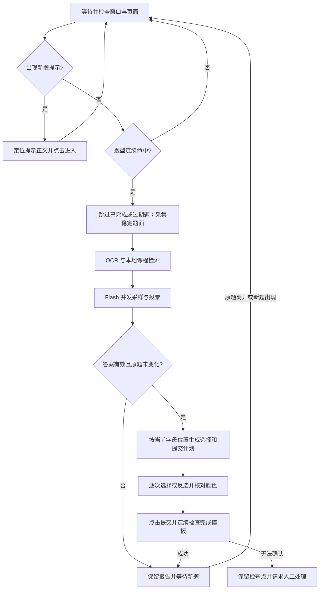

# 架构与运行边界

AutoYKT 采用截图识别、可验证的鼠标输入和独立观察层。正式运行面向 Windows 可见桌面，模型、坐标、课程和通知参数均来自仓库外的私有 YAML。

## 模块

| 模块 | 职责 |
| --- | --- |
| `cli.py` / `__main__.py` | 初始化、检查、标定、课堂运行、状态/停止与知识工具 |
| `core/config.py` / `legacy_config.py` | 严格配置验证、私有路径解析和旧配置迁移 |
| `calibration.py` | 现场或离线区域、模板、按钮颜色与尺寸标定 |
| `monitor/screen_watcher.py` | 串行调度页面，预热 OCR，共享一个鼠标 |
| `monitor/profile_runtime.py` | 单页完整状态机、题目预算与错误处理 |
| `monitor/operations.py` / `windows.py` | 统一点击计划、窗口/页面保护、输入前重验、私有证据 |
| `monitor/detector.py` / `selection.py` | 题型防抖、动态字母定位、灰蓝状态与逐项选择验证 |
| `monitor/page_flow.py` / `cycle.py` | 新题入口、结果页动作和提交反馈验证 |
| `monitor/checkpoint.py` | 在输入前写入意图，阻止重启后重放未确认操作 |
| `monitor/class_session.py` / `health.py` | 两小时时钟、实际扫描记录、状态、停止和累计评估 |
| `monitor/image_inspection.py` / `rehearsal.py` | 无点击图片检查、使用虚拟输入的模型回放 |
| `agent/answer_agent.py` / `consensus.py` | 限时并发采样、严格输出解析和完整答案集合投票 |
| `knowledge/` | 本地 OCR、课件提取、课程隔离的 SQLite 词法检索 |
| `notifier/` / `core/event_bus.py` | 异步观察事件；可选 QQ/Telegram 通知 |

## 一道题的流程

单选与多选来自独立题型模板。出现冲突、重复位置、未识别字母或未知选中颜色时不猜测。多选按整组答案投票，先反选多余项，再补选缺少项，保留已经正确选择的项。

`question_budget` 是从发现题目/提示开始的本地截止时间，不是读取平台倒计时。OCR、排队、模型请求和点击验证共用总预算，并预留提交时间。默认文本 Flash 需要完整的字母到选项文本映射；视觉模型可使用截图，但必须在私有配置中明确设置。

## 输入与恢复

所有正式入口要求窗口绑定、页面身份、动态选项、颜色、提交方式和明确完成模板。输入前核对窗口、无遮挡、当前页面、题目和选项状态；窗口移动时换算坐标，大小变化时暂停。后台监测仍需窗口完整可见，激活后重看题面。

模型重试只发生在尚未输入的阶段。输入前持久化 `pending.json`；提交确认后标为已验证，直到观察到下一题才清除。无法确认的输入需要人工核对，`recover --skip-current` 保存当前页的跳过基线。不得用自动删除检查点来恢复。

普通失焦/遮挡可在条件恢复后继续扫描。加载超时、未确认输入、人工状态会终止该页操作。已答题页面停留是正常等待，不作为故障；异常事件和监测暂停仍计入会话评估。

## 数据与生命周期

所有相对路径从私有配置目录解析，当前工作目录中的配置不会自动加载。密钥不进入模型导出和运行报告。事件中的题目与回答、截图、模板及课程库属于私有数据；默认不上传仓库。

`session` 先预热 OCR，再启动默认 120 分钟计时；状态每秒原子写入，实际扫描次数与心跳分开记录。到期停止接收新题，并在原题预算内收尾；`--stop` 主动取消。Windows 进程锁防止双重控制，保持唤醒请求只在运行期间有效。

通知是观察层，不决定下一步点击。会话关闭先收尾状态机，再排空事件和关闭客户端；排空期间收到的错误也进入最终报告。日志轮转，截图与操作报告保留供核验，需由使用者定期归档。

## 验证

合成图片和虚拟鼠标用于可重复的流程测试；私有 `calibration_samples` 用原尺寸真实图片验证识别；`rehearse` 用实际 OCR/模型和虚拟提交验证答题流程。真实服务器接收、答案正确率和真实连续两小时可靠性，需要课堂报告与人工核对单独证明。参见 [审计记录](audit-2026-09-20.md)。
